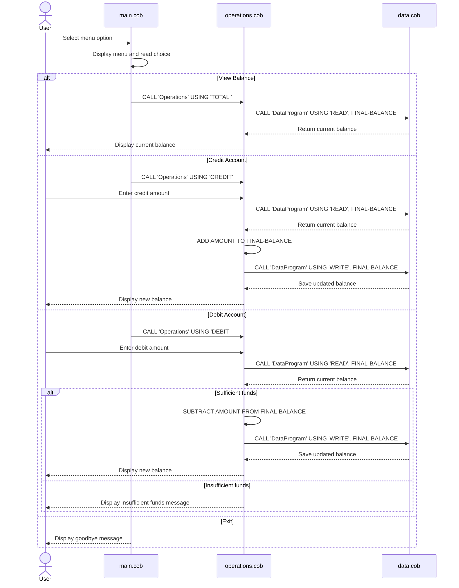

# COBOL Student Account System

This project is a small COBOL-based account management example for a student account. It demonstrates a classic menu-driven program that allows a user to view the current balance, add funds, remove funds, and exit the application.

## Project Structure

### src/cobol/main.cob
Purpose:
- Entry point for the application.
- Displays the main menu and handles user interaction.
- Routes requests to the operations module with operation codes.

Key functions and behavior:
- `MAIN-LOGIC` runs in a loop until the user selects exit.
- Menu options include:
  1. View Balance
  2. Credit Account
  3. Debit Account
  4. Exit
- Uses `CALL 'Operations' USING ...` to invoke the balance logic.
- Validates menu input and displays an error message for invalid selections.

### src/cobol/data.cob
Purpose:
- Acts as the data access layer for the account balance.
- Stores and retrieves the current balance from a single in-memory value.

Key functions and behavior:
- `STORAGE-BALANCE` is initialized to `1000.00`.
- `PROCEDURE DIVISION USING PASSED-OPERATION BALANCE`
  - Reads the balance when `PASSED-OPERATION` is `READ`.
  - Updates the stored balance when `PASSED-OPERATION` is `WRITE`.
- This file is the persistence layer for the current program state.

### src/cobol/operations.cob
Purpose:
- Implements the specific business operations for the account.
- Performs balance reporting, deposits, and withdrawals.

Key functions and behavior:
- `TOTAL `: reads the current balance and displays it.
- `CREDIT`:
  - Prompts the user for an amount.
  - Reads the current balance.
  - Adds the amount.
  - Persists the updated balance.
  - Displays the new balance.
- `DEBIT `:
  - Prompts the user for an amount.
  - Reads the current balance.
  - Verifies that the balance is sufficient.
  - Subtracts the amount and persists it only when funds are available.
  - Displays an insufficient funds message if the withdrawal would cause a negative balance.

## Business Rules for Student Accounts

The logic in this COBOL program implies the following business rules:

- Initial balance: every account starts at `1000.00`.
- A student account can only be credited with a positive amount entered by the user.
- A student account can only be debited when the sufficient funds rule is satisfied.
- Overdraft prevention: a debit is rejected if `FINAL-BALANCE < AMOUNT`.
- The balance is stored and updated in a single memory value, simulating a simple account ledger.
- The program does not enforce transaction limits, interest accrual, fees, or account status rules.
- There are no student-specific fields such as student ID, course enrollment, or tuition billing in this version.

## Architecture Diagram

```text
User
  |
  v
main.cob
  |
  |-- Menu loop and choice validation
  v
operations.cob
  |
  |-- TOTAL / CREDIT / DEBIT logic
  v
data.cob
  |
  |-- READ current balance / WRITE updated balance
  v
In-memory balance value (1000.00)
```

## Summary

This example represents a minimal student account management system built in COBOL. It demonstrates the separation of concerns between:

- the menu and entry flow in `main.cob`
- the data storage logic in `data.cob`
- the business operations in `operations.cob`

It is intentionally simple and best suited for learning how COBOL programs handle procedural flow, parameter passing, and basic account validation logic.

## Sequence Diagram


